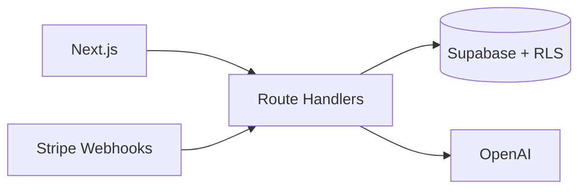

# Output Examples

## Example prompt

> Analise o repositório https://github.com/user/my-saas-app e gere o texto de apresentação para o portfólio.

## Example output

### Resumo

- **Propósito:** SaaS de gestão de tarefas com sugestões de IA
- **Stack:** Next.js, Supabase, OpenAI, Stripe

---

**Título:** TaskFlow AI — SaaS de Produtividade com IA

**Subtítulo:** Plataforma multi-tenant com autenticação, billing recorrente e priorização inteligente de tarefas.

**Descrição curta:** SaaS full-stack que combina quadro Kanban com sugestões de priorização via OpenAI. Backend serverless com Postgres gerenciado, RLS no Supabase e webhooks Stripe para assinaturas.

**Meta descrição:** SaaS de produtividade com IA, Next.js, Supabase e Stripe. Multi-tenant serverless com billing recorrente.

**Descrição completa:**

### Contexto

Ferramentas genéricas de produtividade não ajudam equipes pequenas a decidir *o que fazer agora*. O TaskFlow AI nasce para unificar gestão visual de tarefas com sugestões contextuais baseadas no histórico do projeto.

### O que foi construído

- Autenticação e multi-tenancy com Supabase Auth + RLS
- Quadro Kanban com drag-and-drop
- Integração OpenAI para sugerir prioridades e desmembrar tarefas
- Billing recorrente via Stripe (planos Free / Pro)
- Dashboard administrativo para métricas de uso

### Stack

| Camada | Tecnologia |
|---|---|
| Frontend | Next.js App Router, React, Tailwind CSS |
| Backend | Route Handlers serverless (Vercel) |
| Banco | Supabase PostgreSQL com políticas RLS |
| Pagamentos | Stripe Checkout + Webhooks |
| IA | OpenAI API (gpt-4o-mini) |

### Como funciona

1. O usuário autentica via Supabase; cada query respeita RLS por `tenant_id`.
2. Tarefas são criadas no Kanban; ao solicitar sugestão, o backend monta contexto e chama a OpenAI.
3. Eventos Stripe (`checkout.session.completed`, `invoice.paid`) atualizam o plano via webhook.

### Destaques

Isolamento de dados por tenant na camada Postgres (não apenas na aplicação), webhooks idempotentes para billing e prompts enxutos para controlar custo de tokens.

---

**Slug sugerido:** taskflow-ai-saas
**Repositório:** https://github.com/user/my-saas-app

**Tecnologias sugeridas:** Next.js, Supabase, Stripe, OpenAI
**Tags sugeridas:** SaaS, Inteligência Artificial
